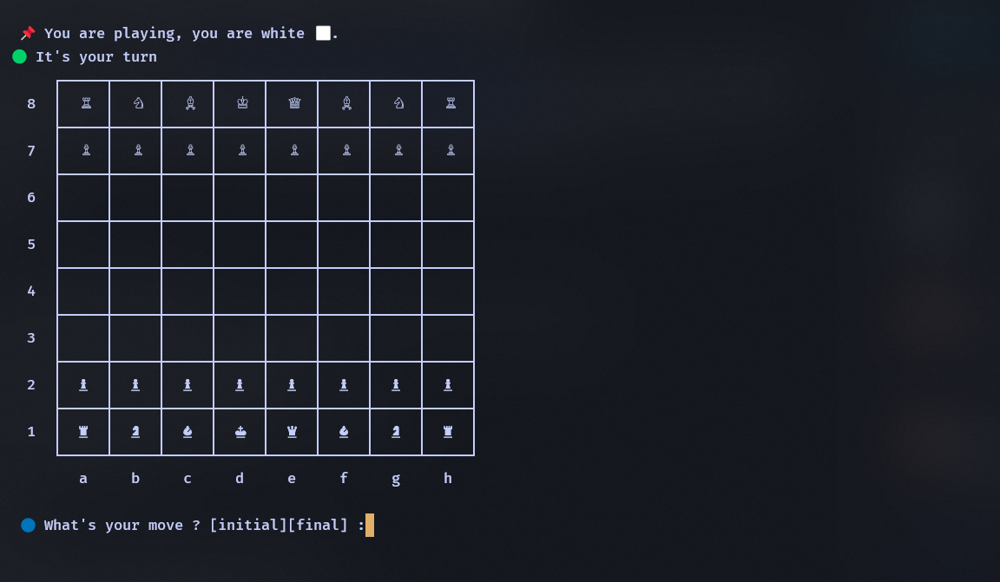

# ♟️ Jogo de Xadrez Online via terminal 

 🧠 Decidi criar esse projeto para o [Hack Club Summer of Making 2025!](https://summer.hackclub.com/). Um servidor e um client de um jogo xadrez online desenvolvido com Go e WebSocket usando a biblioteca [gorilla/websocket](https://github.com/gorilla/websocket). O servidor permite a conexão de dois jogadores, gerencia o jogo e verifica a integridade da conexão usando um sistema de ping/pong. O client é responsável pela conexão com o sevidor e renderização do jogo no terminal do player. 

 

### 📌 Progresso
#### ✅ Feito

- [x] Criar servidor WebSocket básico 
- [x] Estruturar projeto com separação de responsabilidades (`game/`, `core/`, `server/`)
- [x] Criar lógica de pareamento entre dois jogadores
- [x] Criar tipo `Player` com controle de conexão
- [x] Implementar monitoramento de conexão com `ping/pong`
- [x] Encerrar a partida ao detectar desconexão
- [x] Estrutura basica do client
- [x] Tratando do envio de jogadas pelo player
- [x] Definir representação do tabuleiro de xadrez
- [x] Validar jogadas no servidor
- [x] Melhorar a logica de troca de mensagens e tipos de mensagens 

#### 📍 Atualmente 

- [ ] Implementar controle de turno e regras de movimento
- [ ] Implementar cronômetro por jogador (ex: 10 minutos)
- [ ] Detectar xeque, xeque-mate e empate
- [ ] Finalizar partida quando o tempo de um jogador acabar

#### 🧠  Etapas Futuras
- [ ] Melhorar a representação do tabulerio no client side

## 📁 Estrutura do Projeto

```bash
chess-server/
├── cmd/
│   ├── client/main.go
│   └── server/main.go
├── interal/
│   ├── pkg/          # Pacotes utilitarios 
│   ├── protocol/     # Protocolo de troca de mensagens entre server e client
│   ├── server/       # Parte do servidor 
│   ├── client/       # Parte do client
│   ├── game/         # Estrutura central do game
│   ├── net/          # Conexão entre client e servidor 
│   ├── logic/        # Logica do jogo, movimentos, tabuleiro,...
│   ├── ui/           # Gerenciamento da UI do cliente
│   └── models/       # Modelos e structs
├── go.mod
└── README.md (this file)

